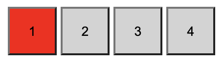

# BNTA Course Notes

## BEM Naming Convention Notes

### Introduction

BEM = Block Element Modifier

BEM is a suggested way of structuring your `class` and `id` names, not an enforced system. It is a *naming convention* for CSS.

As is in the name, BEM suggests that you create your `classes` in the form of Block-Element-Modifier:

**BLOCK**

You are defining the greatest content of element (the block)

*Example: navBar*

**ELEMENT**

Then the item you are controlling (the element). A double underscore is used to separate block from element

*Example: navBar__title*

**MODIFIER**

And then (optionally) a modifier (a modifier)

*Example: navBar__title--red*

This isn't a great example of how we use the **Modifier** however, as we're likely to only have one navbar on our page.

Let's look at another example where we've created a `button` that's reused across the site with the same general styling but that different colours

Say we have four buttons within a `menu` section, where the first is red but the rest are the default colour of grey:

```html
<button class="menu__button menu__button--red">1</button>
<button class="menu__button">2</button>
<button class="menu__button">3</button>
<button class="menu__button">4</button>
```

```css
.menu__button {
	background-color: lightgrey;
	height: 50px;
  	width: 50px;
}

.menu__button--red {
	background-color: red;
}
```



Note how we are applying TWO classes to the first, red, button and that we're not simply applying the one with the specified change. BEM hence relies heavily on **specificity** and utilising the system provided. It may seem somewhat counter-intuitive and wasteful to do this, since the button has *mutliple* `background-color` attiributes being applied, but it is far **cleaner to do this than to re-specify** the applied `height` and `width` attributes within the `.menu__button--red` class

## Why?

**Easier to Understand & Maintain**

We use BEM to make our code easier for ourselves and others to maintain. It often makes our code more verbose, but it does so with a massive boost to clarity. Each class is named in such a way that you can recognise not only what it applies to but also it's wider context.

**Keeps Code in as Few Places as Possible**

By playing with the specificity and using modifier classes to only target specific parts of an item's styling, we also ensure that our styling tends to as few places as possible, which makes debugging and wide-spread changes easy to enact.

**Keeps Your CSS Flat**

By using specifically a combination of different classes, we can ensure that the specificity of your rule set is easy to predict and modify.

## What is a Block?

BEM is not strict; As I mentioned above, it is a *suggestion* which betters *organisation*. There is hence some varience in how it is used, depending on the opinion of the user. This largely comes down to one question of: "What is the Block?"

The official BEM website says:

*"[A block] Encapsulates a standalone entity that is meaningful on its own. While blocks can be nested and interact with each other, semantically they remain equal"*

Which leads me again to the point of *organisation*. Well-built websites don't start their coding developement period at the start of the project. There is a whole production line with different stages to development, critically starting with **design** and **wireframing** processes before any developer starts coding. What I'm trying to get at here, is that a website should be thought of as a whole, cohesive design, built of discrete parts ahead of any code being produced. These potentially reusable parts are what define your **Blocks**. While wider context does vary between elements, it is common for discrete code blocks to share styling properties and this is what BEM hopes to streamline. 

### What is a Block? - An Example

For example, let's say we have two of the same button within completely separate parts of your page. One sits within our `navBar` component and another sits within the `footer`. I'll define two code blocks below with stripped-down code:

```html
	<nav class="navBar">
		<button class="button">Click Me!</button>
	</nav>
```

```html
	<footer class="footer">
		<button class="button">Click Me!</button>
	</footer>
```

This is a very generic example but it leads on nicely to the main point people get stuck on with BEM:

*"Should I define the class as `button` or should I define greater context, making the classes `navBar__button` and `footer__button` instead?"*

Or more generally:

*Is "button" the Block or the Element?*

Which, unfortunately, has the answer of **"It depends"**.

If the button was strictly part of the `navBar` component and hence held distinct styling then it make sense to define it's class as `navBar__button`. Otherwise, and especially if the styling could be reused for another button elsewhere on the page (such as within the `footer` above), having a more generic `button` class would be more efficient.

Some developers, however, would argue that even without distict styling, there is merit in defining this button's styling using a more specific class as it *better communicates to another person what is it they're looking at*. This would, of course, come with a slight increase in the amount of CSS rules you were applying, and would increase the number of properties you'd have to change if both buttons were to be changed slightly—it is all a balance.

## The Main Takeaway

BEM is simply a suggested naming convention for your CSS. It doesn't need to be adhered to strictly. What you should consider a requirement, however, is ensuring that your code is understandable and maintainable to someone, regardless of when they joined the team or otherwise looked at your code.

Even if it is your own code, there is no guarantee that you will be able to understand what you were getting at previously. Help others to potentially help yourself!

## Further Reading

[Official BEM Website](http://getbem.com/naming/)

[CSS Tricks - BEM 101](https://css-tricks.com/bem-101/)

---

*please note that these course notes are a first-pass draft and may be fleshed out / modified in future*