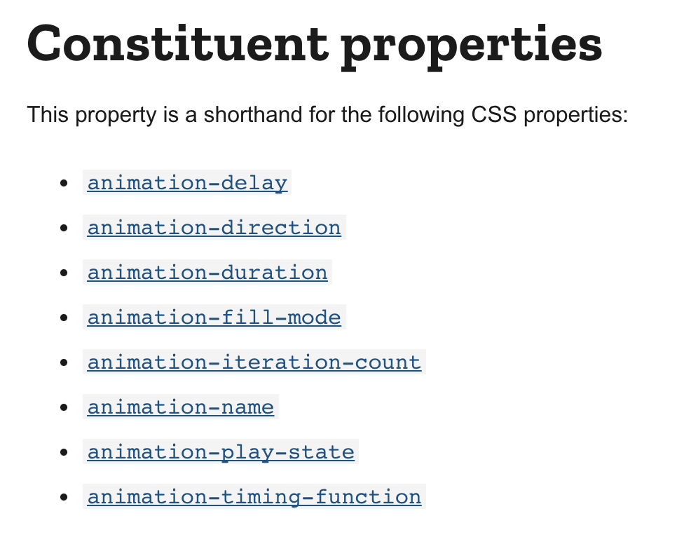
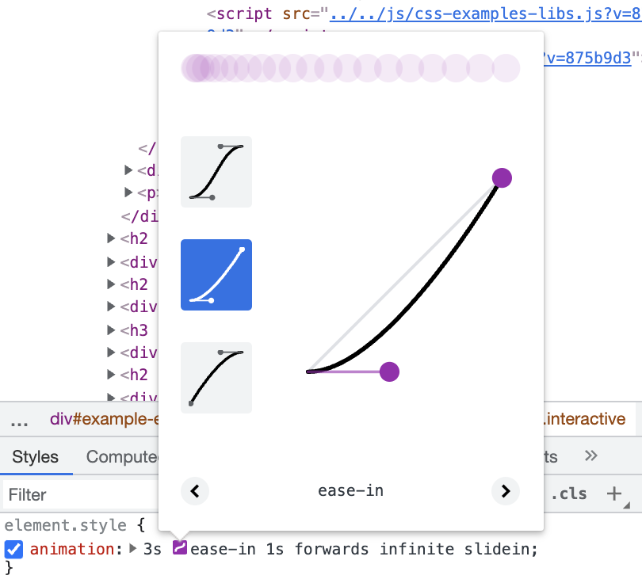

# BNTA Course Notes

## CSS Animations

Animations can really make something you've produced pop. They add a bit of drama, a bit of pizzazz but also a slew of accessibility concerns and fiddly functionality. It turns out that making something look nice is more than a way of thinking, it's an art. That said, don't allow that to deter you from playing about with the entire toolkit that is provided to you within HTML and CSS. 

These notes will be brief as this is a fairly small topic and they'll likely be amalgomated into a larger document down the time. I'll quickly outline the two main ways that we can define animation effects below however so that you have a good starting point.

## Explicit Animations

[MDN - Using CSS Animations](https://developer.mozilla.org/en-US/docs/Web/CSS/CSS_Animations/Using_CSS_animations)

[MDN - "animation" Attribute](https://developer.mozilla.org/en-US/docs/Web/CSS/animation)

CSS Animations can seem pretty strange to get your head around when you first look up an example. This is because declaring an animation comes in two parts which is at odds to how styling is generally declared. First, we need to define the **keyframes** of the animation (**what** we want the animation to do) and then we also need to apply the `animation` property to the relavent element to define **how** we want the animation to proceed.


**Keyframes**

Keyframes simply define the processes of your animation. This is most commonly achieved by defining the affected properties at a selection of percentage points, relavent to the timescale of the animation. This sounds a bit wordy so let's look at an example:

```css
@keyframes slidein {
  from {
    left: -100%;
  }

  to {
    left: 0;
  }
}
```
This animation could be used with an element with `position: absolute` to make it slide-in on load of the page.

An example for the `animation` property could be:

```css
animation: 3s ease-in 1s forwards slidein;
```

Note that the `animation` property is a parent property for many separate CSS rules:



The above `animation` property hence maps to:

```css
animation-duration: 3s;
animation-timing-function: ease-in;
animation-delay: 1s;
animation-fill-mode: forwards;
animation-name: slidein;
```
A couple properties worth pointing out here are:

`animation-fill-mode` which defines whether the element persists on screen on completion of the animation. If you want an element to slide in and then stay at the end point then you need `animation-fill-mode: forwards` as above.

`animation-timing-function` which defines how an element proceeds through the `keyframes` defined. An easy way to think about it is to consider that the property assigns different amounts of time to different part of the animation. `animation-timing-function: ease-in`, for instance, allocates more time at the beginning of the function, *easing-in* the transition. The timing function is hence a plot of animation progression vs. animation completion, which is then mapped to the `animation-duration` provided. The plot forms a cubic Bézier curve which you can play about with within the browser's dev tools by clicking the small purple button shown below:



The `animation-timing-function` can also be applied to specific 

## Transistions

Something that's really cool and is worth knowing about is the `transistion` property. This property allows you to create **implicit animations** (without needing to define keyframes) with the computer working out how to smoothly adjust an element's styling across the specified timeframe. When you start playing with custom HTML data-attributes and/or State, creating dynamic web-pages based off a users' input, then `transition` can easily bolster the user-experience by ensuring no sharp changes occur on-screen.

The property is simply defined in the form of:

```css
transition: 1s;
```

As an explicit example, let's refer back to the red & blue box from the Vanilla JS Events content. When we clicked our button, the box changed from red to blue. Clicking the button again would cause it to switch from blue back to red. If we apply a `transition` property to the `box` then we can cause the colour to transition through a purple colour.

Let's take the example from the previous section above (the `slidein` animation) and change it to use `transition` instead. Previously, we had the element simply sliding in on page load, but we could change it to instead use an HTML custom attiribute (introduced in the JS Event content). Let's say that is is a retractable menu with `class="menu"`. By defining a `data-active` attribute which is affected in some manner by the user agent (for example, a `click` or `hover` event), we can then simply put two sets of CSS rules for the element: `.menu` and `.menu[data-active="true"]`

`.menu` defines all the styling for the element, including the initial position of `left: -100%` and our new `transition: 1s` property.

The `.menu[data-active="true"]` has only one property, which is simply `left: 0`.

On activiation of the element (turning `data-active` to `true`), and hence application of the second CSS rule set, we see that the element slides in! Transitions are great for interactive elements for this reason so have a play about and see what use cases you can think of!


---

*please note that these course notes are a first-pass draft and may be fleshed out / modified in future*