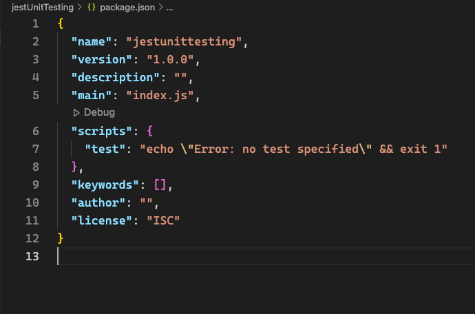
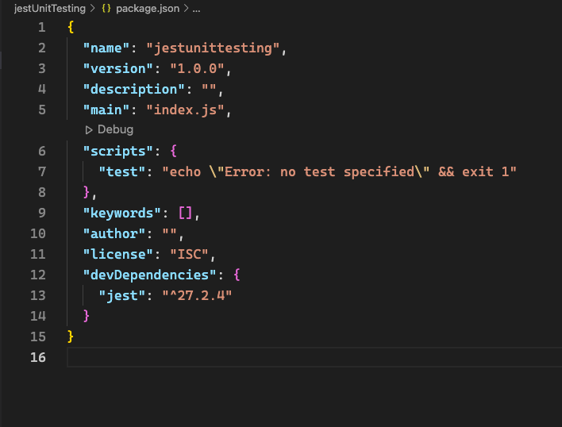
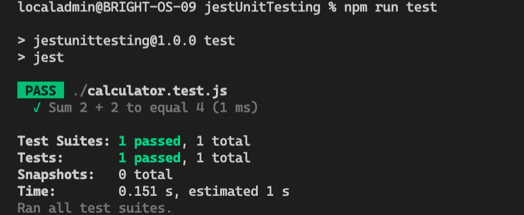

# An Introduction to Jest Unit Testing

## Table of Contents

- [Starting a JavaScript Project](#starting-a-javascript-project)
  - [Creating a New JS Package](#creating-a-new-js-package)
  - [Package.json](#package-json)
  - [Command Summary](#command-summary)
- [Software Testing](#software-testing)
  - [Unit Tests](#unit-tests)
  - [Jest](#jest)
  - [Installing Jest](#installing-jest)
  - [First Jest Unit Test](#first-jest-unit-test)
- [Jest Testing](#jest-testing)
  - [Jest Matchers](#jest-matchers)
  - [Test Coverage](#test-coverage)

## Starting a JavaScript Project

<br>

As developers we often have to share code with other developers so it's important that our projects are reproducible and easy to share.

<br>

This is where npm comes in which stands for node package manager.

<br>

### Creating a new package

<br>

If we create a new project folder using:

```
mkdir jestUnitTesting
```

And then we change to that directory using:

```
cd jestUnitTesting
```

We can then set up a new npm package using the command:

```
npm init
```

or:

```
npm init -y
```

to accept all of the defaults which is the command we are going to use.

<br>

This creates a **package.json**.

<br>

### Package.json

<br>

A **package.json** file:

<br>

- lists the packages your project depends on
- specifies the versions of installed packages that your project can use
- makes your build reproducible, and therefore easier to share with other developers

<br>

### Command Summary

<br>

- `mkdir jestUnitTesting`
- `cd jestUnitTesting`
- `npm init -y`

<br>

## Software Testing

<br>

**Software Testing** is the process of writing code that checks whether code present in your application is doing what you expect it to do.

<br>

It is a way of verifying that an application under development is working how it is expected to. Writing tests can help prevent bugs and improve performance, and is also a way to ensure that previously functioning code isn't broken when code is refactored.

<br>

### Unit Testing

<br>

A common type of testing which we will be using today is called **unit testing**.

<br>

**Unit Testing** is about isolating small sections of code such as functions and class methods to verify that they are working.

<br>

An analogy could be that if you had a mansion and all the electrics ran off the same circuit and all of a sudden the lights go out. An electrician would have a very difficult time and a very time costly procedure to work out where the break in the circuit was located if you had 100 rooms in your mansion.

<br>

Alternatively if the mansions electrics were broken up so there was one circuit per room and then if a particular circuit in a particular room broke, a switch on your fuse box would flick down to indicate which room had the problem. This would allow the electrician to go right to the source of the problem.

<br>

Unit tests function in a similar way in that if we test isolated small sections of code and we find that a particular test is **failing** we, as developers, can go right to the source of the problem to fix it reducing development time and costs for our business.

<br>

### Jest

<br>

Jest is a JavaScript testing framework maintained by Facebook with a focus on simplicity and support for large web applications.

<br>

[Jest Documentation](https://jestjs.io/)

<br>

### Installing Jest

<br>

After entering the command `npm init -y` we are greeted with a **package.json** that looks like this:



<br>

At this point, we are ready to install Jest.

<br>

To install Jest we need to make sure we are in the directory that contains our **package.json**.

<br>

For us this will be the **jestUnitTesting** directory.

<br>

From this directory we can then run the command:

```
npm i -D jest
```

which is shorthand for:

```
npm install --save-dev jest
```

where the `i` is for `install` and the `-D` is for `--save-dev` which means to save the package we are installing to our package.json as a dev dependency which stands for development dependency.

<br>

If a dependency isn't required for your program or application to run but is required for the development process of your application it is best to save that dependency as a dev dependency. This indicates to other developers that your program does not require it to run but it was used in the development process of your application.

<br>

### First Jest Unit Test

<br>

Now that we've initailized our **jestUnitTesting** directory as an npm package which created our **package.json** and we've also installed Jest, we're almost ready to write our first Jest test.

<br>

Before we do we're going to edit our **package.json** so we can run our tests with npm.

<br>

After installing Jest as a dev dependency our **package.json** should look like this:

<br>



<br>

We are going to edit line 6 of our **package.json** where we have:

```
"test": "echo \"Error: no test specified\" && exit 1"
```

and change it to:

```
"test": "jest"
```

<br>

**After you've done this make sure to save the changes you've made to your package.json file.**

<br>

Now what we are going to do is create a new file that is going to contain the first function that we will be testing.

<br>

So again making sure that we are in the **jestUnitTesting** directory, in VSCodes integrated terminal we're going to type:

```
touch calculator.js
```

and then:

```
code calculator.js
```

Inside this file we're going to write a simple sum function that will take two parameters and return their sum:

```
const sum = (a, b) => a + b;
```

Now we need to export this function to make sure we can test it so underneath our function we're going to add:

```
module.exports = { sum };
```

So our calculator.js file should look like:

```
const sum = (a, b) => a + b;

module.exports = { sum };
```

We can now create our test file, to do this in our integrated terminal in VSCode and again in the **jestUnitTesting** directory we type:

```
touch calculator.test.js
```

and then:

```
code calculator.test.js
```

to open our file in VSCode.

<br>

The test files are named in the format **filename.test.js** so that jest can detect them.

<br>

In our test file we are going to write our first test but first we must import the function which we are testing which in this case is called sum from our file caclulator.js.

<br>

To do this we are going to add this line to our test file:

```
const { sum } = require("./calculator");
```

After we've done that we are ready to write our test:

```
test("Sum 2 + 2 to equal 4", () => {
  expect(sum(2, 2)).toBe(4);
});
```

<br>

At this point we've changed our **package.json** so that it includes `"test": "jest"` so that we can run our tests using npm.

<br>

We've written the function we are testing and we've written our test to test it.

<br>

With the below command we can now run our tests by typing it in to our integrated terminal whilst inside the **jestUnitTesting** directory:

```
npm run test
```

<br>

The output in your terminal should look like the below:

<br>



<br>

## Jest Testing

<br>

Jest uses something called "matchers" to let you test values in different ways.

<br>

In the test we have just written:

```
test("Sum 2 + 2 to equal 4", () => {
  expect(sum(2, 2)).toBe(4);
});
```

our matcher was `toBe(4)` and as we can see, the structure of our test is:

```
test("what is being tested and expected result description", () => {
  expect(expectationValue).matcher(result);
});
```

<br>

This is the structure that each test you write in **Jest** will follow.

<br>

### Jest Matchers

<br>

The matcher we have just seen, `toBe` is used to test for exact equality. This is when `something === somethingElse` returns `true`. In other words when `something` and `somethingElse` are of the same type and have the same value.

<br>

If we wanted to just check that the value of two objects was the same then we would use `toEqual` instead.

<br>

For numbers like in our test, `toBe` and `toEqual` have the same function since the value and the type are the same.

<br>

**Numbers**

<br>

Most ways of comparing numbers have matcher equivalents as we can see below:

```
test("Sum 2 + 2", () => {
  expect(sum(2, 2)).toBe(4);
  expect(sum(2, 2)).toEqual(4);
  expect(sum(2, 2)).toBeGreaterThan(3);
  expect(sum(2, 2)).toBeGreaterThanOrEqual(3.5);
  expect(sum(2, 2)).toBeLessThan(5);
  expect(sum(2, 2)).toBeLessThanOrEqual(4.5);
});
```

For floating point equality use `toBeCloseTo` instead of `toEqual` because you don't want a test to fail because of a tiny rounding error:

```
test("adding floating numbers", () => {
  expect(sum(0.1, 0.2)).toBeCloseTo(0.3);
});
```

**Truthiness**

In tests sometimes you need to distinguish between `undefined`, `null`, and `false`, but you sometimes do not want to treat these differently. Jest contains helpers that let you be explicit about what you want.

- `toBeNull` matches only `null`
- `toBeUndefined` matches only `undefined`
- `toBeDefined` is the opposite of `toBeUndefined`
- `toBeTruthy` matches anything that an `if` statement treats as true
- `toBeFalsy` matches anything that an `if` statement treats as false

<br>

For example:

<br>

```
test('null', () => {
  const n = null;
  expect(n).toBeNull();
  expect(n).toBeDefined();
  expect(n).not.toBeUndefined();
  expect(n).not.toBeTruthy();
  expect(n).toBeFalsy();
});

test('zero', () => {
  const z = 0;
  expect(z).not.toBeNull();
  expect(z).toBeDefined();
  expect(z).not.toBeUndefined();
  expect(z).not.toBeTruthy();
  expect(z).toBeFalsy();
});
```

You should use the matcher that most precisely corresponds to what you want your code to be doing.

**Arrays and iterables**

You can check if an array or iterable contains a particular item using `toContain`:

```
const shoppingList = [
  'milk',
  'eggs',
  'petrol',
  'toilet roll',
  'bacon'
];

const addItemToList = (list, item) => {
  list.push(item);
  return list;
};

const removeItemFromList = (list, item) => {
  const index = list.indexOf(item);
  list.splice(index, 1);
  return list;
};

test("the shopping list has milk on it", () => {
  expect(shoppingList).toContain("milk");
  expect(removeItemFromList(shoppingList, 'milk')).not.toContain('milk');
  expect(addItemToList(shoppingList, 'milk')).toContain('milk');
});
```

<br>

### Test Coverage and Exercises

A useful tool to know about is coverage. Hopefully by now, you have an idea of why testing is useful and how to write some but it is also useful to know how much of our application has been covered by a test.

<br>

To do this, underneath the line `"test": "jest"` in our **package.json** we can add:

```
"test:coverage": "jest --coverage"
```

<br>

In our integrated terminal whilst in the **jestUnitTesting** directory we can type:

```
npm run test:coverage
```

<br>

This then generates coverage data about how many statements, branches, functions and lines that we have covered with the test we have written.

<br>

Your exercises for this afternoon is to start with the code in the folder afternoonExercises, generate a code coverage and use the notes above to write tests for the functions that we did not write tests for in todays lesson.
